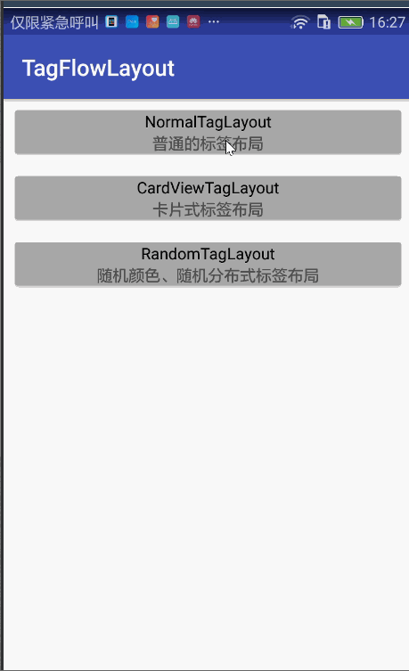
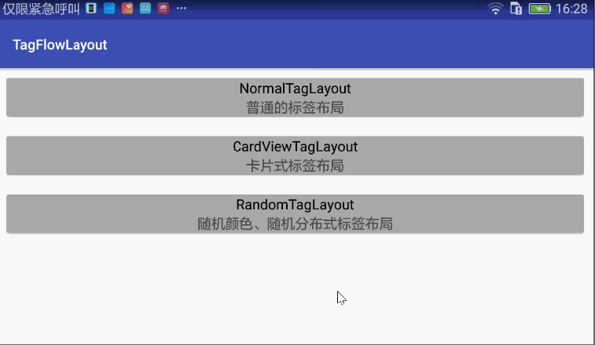

[](https://jitpack.io/#SeachForLife/TagFlowLayout)

# TagFlowLayout
TagLayout for android

# 运行效果

|竖屏效果|横屏效果|
|:-----|:-----|
| | |

# Gradle

```groovy
	allprojects {
		repositories {
			...
			maven { url 'https://jitpack.io' }
		}
	}
  
  dependencies {
	        compile 'com.github.SeachForLife:TagFlowLayout:v1.0'
	}

```
